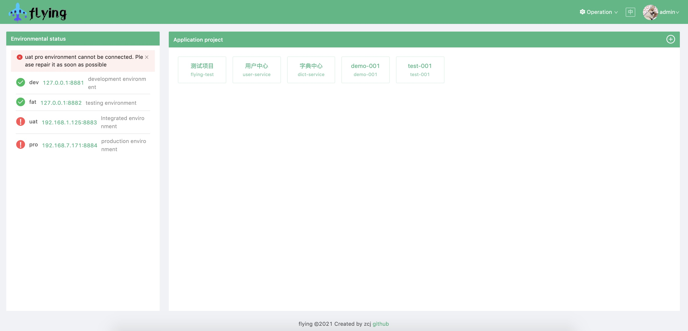

[Flying](https://github.com/ZhangChengJi/flying.git) is a microservice multi-environment cloud native configuration center



> English | [Chinese](README_zh.md)

## Introduction

At present, the direction of microservice architecture is gradually moving closer to the grid of kubernetes services, and the concept of multi-environment and multi-cluster appears. Flying can realize the unified management of multi-cluster microservice configuration.

Services are divided into:

+ **flying-admin management terminal:** The management interface is used to manage the configuration of multiple flying-config servers. It is mainly for adding and modifying `environment`, `application project` management, `namespace` publishing and other functions.

+ **flying-config server:** The real configuration center server, responsible for configuring information storage, pushing client notifications, etc. Can be deployed in multiple environments.

+ **flying-client client:** Configuration receiving function, real-time update configuration and other functions. At present, only the Java client connection is implemented, and more language clients will appear in the future.

## Function description

+ Unified management of multi-environment and multi-cluster configuration server
  + One-click configuration of multiple environment servers for management directly through the management interface
  + No need to restart the management end to configure the server
+ Multi-server running status monitoring
  + When connecting to servers in multiple environments, the connection status will be displayed in real time

+ Configure hot reload
  + After the configuration is modified and released, the client receives the newly released configuration within 300 milliseconds
+ High remote connection efficiency
  + The remote communication of the whole structure adopts grpc connection and tls encryption, which is efficient and safe. You can customize the encryption certificate.


## Quick start

**deploy**

1. Clone the code repository

   ```shell
   $ git clone https://github.com/ZhangChengJi/flying.git
   ```

2. Start the service

   In the root directory of flying, create a service through docker-compose

    ```sh
   $ docker-compose -f ./deployments/docker-compose/docker-compose.yaml up
    ```

Through the above command, you can access from http://localhost:8888/, the default account: admin/123456

After startup, configure the environment to connect to the server through the graphical interface of the management terminal. Note that the default network of docker is bridge, and you cannot connect directly with the localhost:8881 address. Please use `flying-config:8881` or `{local ip}:8881` connection.

When connecting to the management server, the environment name should be defined as follows.

- DEV
  - Development environment

- FAT
  - Test environment, equivalent to alpha environment (functional test)

- UAT
  - Integrated environment, equivalent to beta environment (regression testing)

- PRO

    - Production Environment

  

Note: The docker-compose deployment method is only suitable for testing. For real production use, please use the HA database.

>It is recommended that the management end and the server end use containers for convenient and efficient deployment. The deployment scripts of docker-compase and kubernetes can be found in the /deployments directory. Of course, it can also be deployed via binary.


**SDK docking**

+ Java client

  1. Add the flying-client maven package file to your springboot project:

     ```xml
      <dependency>
         <groupId>com.github.zhangchengji</groupId>
         <artifactId>flying-client</artifactId>
         <version>1.0.0</version>
      </dependency>
     ```

     Imported successfully

  2. Change application.yml to bootstrap.yml in springboot

  3. Add configuration in the bootstrap.yml file:

     ```yml
     spring:
       profiles:
         active: ${ACTIVE:dev} # Configure the startup environment, if the environment variable $ACTIVE is configured with the environment name, then the $ACTIVE will be used by default
       flying:
         bootstrap:
           app-id: scaffold-user #Current own project name
           enabled: true # Whether to open the flying configuration center, the default is false
           refresh-enabled: true # Whether to enable real-time configuration update, default is false
           namespace: default # The namespace name of the current project configuration information configured on the server side, there can be multiple, separated by multiple commas
           address: # Configure multiple environments, the environment loading configuration will be selected according to the spring.profiles.active environment name at startup
             - name: uat # environment name
               url: flying-config.flying.svc:8881 #Environment address (server address)
     ```

     

+ golang client

  Undeveloped.....

## kubernetes multiple environments

+ When using the flying configuration center in multiple kubernetes clusters, it is recommended to only establish the flying-admin management terminal in the internal network/test environment, and then expose the grpc encrypted connection address of the flying-config server in each cluster through the dedicated line or external network ip.
+ When the microservices in each cluster connect to flying-config, it is recommended to use the kubernetes service attribute name to connect, for example: `flying-config.flying.svc:8881`


## License

This project has obtained [Apache 2 License](https://github.com/ZhangChengJi/flying/blob/master/LICENSE).

## User registration

> Users are welcome to register in [https://github.com/ZhangChengJi/flying/issues/1](https://github.com/ZhangChengJi/flying/issues/1)

|      |      |      |      |
| ---- | ---- | ---- | ---- |
|      |      |      |      |
|      |      |      |      |
|      |      |      |      |


## contact us

Email 380702562@qq.com 